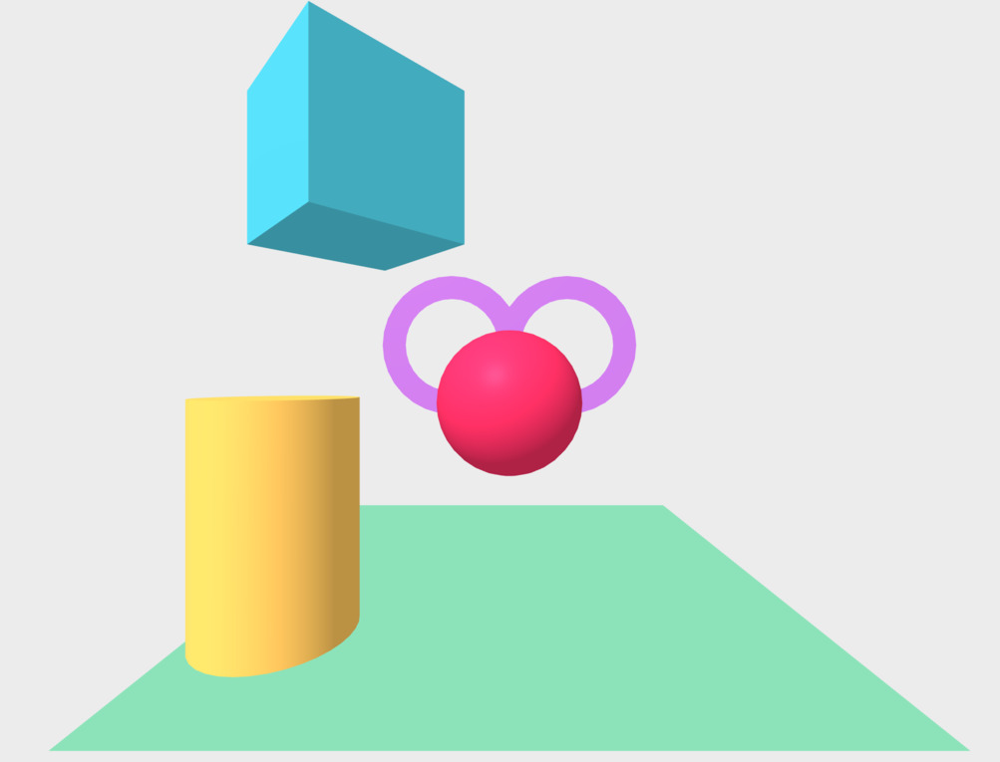
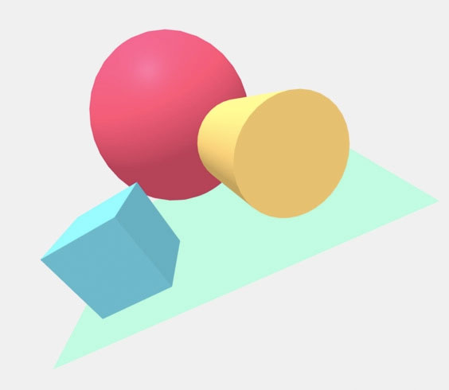

# Hello WebVR – A first scene with A-Frame
(source: https://aframe.io/aframe-school)

## Manipulating primitives

### Positioning objects in 3D / VR

Exercises:

- Move the cylinder left by decreasing the position's X value
- Move the box up by increasing the position's Y value
- Move the sphere back by decreasing the position's Z value
- Extra Credit: Add `<a-ring>` as a child of `<a-sphere>` and give it a position to see relative positions

### Rotation 

Exercises:

- Rotate the cylinder around the X axis so we see the bottom
- Rotate the box around the Y axis so the box is facing straight
- Extra Credit: Wrap the scene contents in `<a-entity>` (like a `
`) and give it a rotation to see relative rotations

### Add Primitives

Exercises:

- Add `<a-torus-knot>` to the left
- Add `<a-dodecahedron>` to the right
- Add `<a-text>` aligned in the center
