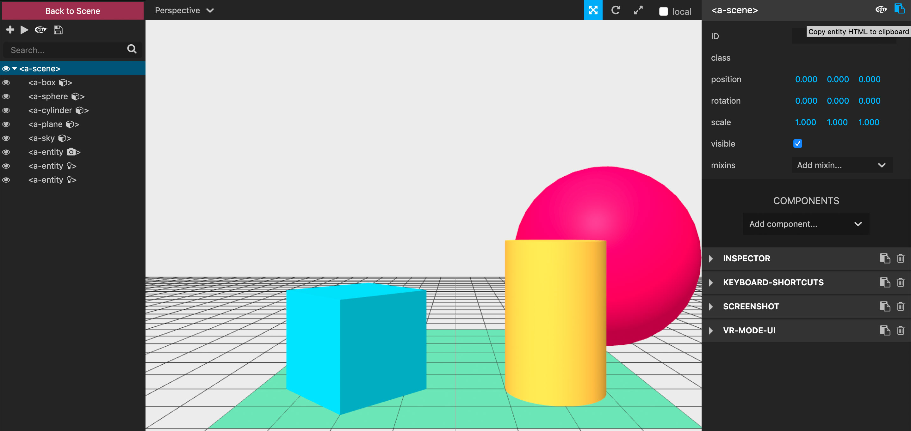

# A-Frame Inspector
(source: https://aframe.io/aframe-school)

## A-Frame Inspector

Hit ctrl + alt + i (Windows) or control + option + i (Mac) on any A-Frame scene to pop open a visual editor.

Excercises:

- Open the A-Frame Inspector on your scene
- Change the position of a an entity of your scene
- Copy the markup of your edited scene into the clipboard (button top right)
- Paste your edited scene into your HTML-file

