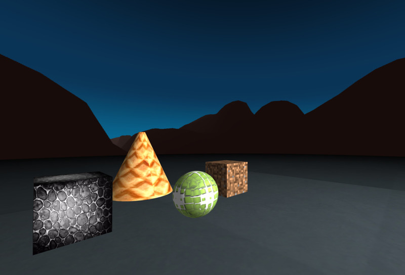

# Textures
(see A-Frame school: https://aframe.io/aframe-school)

## Setting up your scene

Please create a scene which consists of a plane, a box (`<a-box>`), a sphere (`<a-sphere>`), a cone (`<a-cone>`) and a sky (`<a-sky>`).

Exercises:

- Add an image texture to the ground, `<a-plane>`
- Add image textures to `<a-box>`
- Add an image texture to `<a-sphere>`
- Add an image texture to `<a-cone>`
- Add an image texture to the background, `<a-sky>`. You could use 360° images from Flickr, if you want to: https://www.flickr.com/groups/equirectangular/. 
